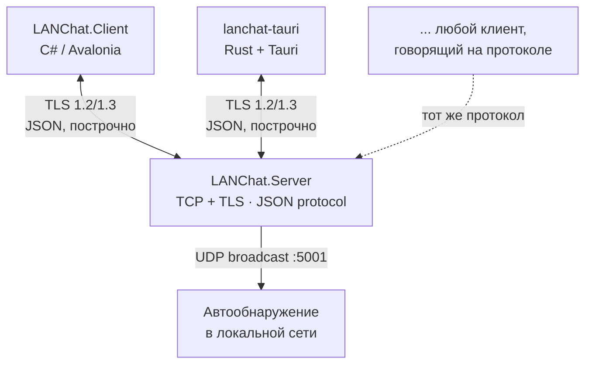

<div align="center">

# 💬 LANChat

**Защищённый мессенджер для локальной сети — без интернета, без серверов третьих лиц, без компромиссов.**

TCP + TLS 1.2/1.3 · JSON-протокол · Два независимых клиента · Self-hosted

[](https://dotnet.microsoft.com/)
[](https://tauri.app/)
[](https://avaloniaui.net/)
[]()
[]()

</div>

---

## О проекте

**LANChat** — это чат для локальной сети (LAN), который поднимается за секунды и не зависит ни от какого внешнего сервиса. Один компьютер запускает сервер, остальные находят его автоматически (UDP-discovery) и общаются напрямую внутри сети — весь трафик зашифрован TLS, ни одно сообщение не покидает вашу локалку.

Проект существует в двух клиентских реализациях с общим протоколом:

| | **LANChat.Client** | **lanchat-tauri** |
|---|---|---|
| Стек | C# / Avalonia UI | Rust + Tauri 2 + HTML/JS |
| Стиль | Классический десктопный GUI | New-style интерфейс |
| Платформы | Windows, Linux | Windows, Linux, macOS |
| Статус | Стабильный, полнофункциональный | Активно развивается |

Оба клиента говорят на одном JSON-протоколе поверх TLS и полностью совместимы друг с другом в рамках одного сервера.

---

## ✨ Возможности

<table>
<tr><td width="50%" valign="top">

**Ядро**
- 🖥️ TCP-сервер с полной изоляцией клиентов
- 🔐 TLS 1.2/1.3 с динамическими сертификатами
- 📡 Автообнаружение сервера в LAN (UDP, порт 5001)
- 🧵 JSON-протокол, построчная потоковая передача
- 👥 Список подключённых пользователей в реальном времени

</td><td width="50%" valign="top">

**Общение**
- 💬 Обмен сообщениями и системные уведомления
- 🗂️ История последних сообщений при подключении
- ✉️ Личные сообщения (ЛС)
- ⌨️ Индикатор «печатает…»
- 📎 Передача файлов (чанками, base64)

</td></tr>
<tr><td width="50%" valign="top">

**Безопасность**
- 🛡️ Защита от подделки отправителя (сервер сам проставляет `Sender`)
- ⏱️ Read/Write таймауты — защита от «зависших» соединений
- 💓 Keep-Alive таймауты сокетов
- 🚫 Лимит длины сообщения (защита от переполнения памяти)
- 🐌 Rate limiting (анти-спам, 500 мс)
- 🧯 Изоляция ошибок в broadcast — один сбойный сокет не роняет остальных
- 🔤 Санитизация ников (защита от поломки протокола)

</td><td width="50%" valign="top">

**DevEx**
- ⚙️ Автоустановка (`install.sh` для Linux/Termux, `install.ps1` для Windows) — ставит .NET SDK, Rust и Node.js сами
- 📦 Self-contained релизы одним файлом (`publish.sh` / `publish.ps1`)
- 🏗️ Нативные инсталляторы для Tauri-клиента (`.msi`, `.AppImage`, `.deb`, `.dmg`)
- 🧩 Оба клиента полностью совместимы по протоколу

</td></tr>
</table>

---

## 🏗️ Архитектура



Сервер не хранит ничего на диске — вся история и состояние живут в памяти процесса, пока он запущен.

---

## 📁 Структура репозитория

```
LANChat/
├── LANChat.Server/          # Консольный TCP/TLS-сервер
│   ├── ClientConnection.cs  # Обработка одного подключения, протокол
│   ├── ClientManager.cs     # Реестр клиентов, broadcast, история
│   └── Models/ChatMessage.cs
├── LANChat.Client/           # Классический GUI-клиент (Avalonia MVVM)
│   ├── Services/ChatClient.cs
│   ├── ViewModels/
│   └── MainWindow.axaml
├── lanchat-tauri/            # New-style клиент (Rust + Tauri)
│   ├── src/                  # Frontend (HTML/CSS/JS)
│   └── src-tauri/src/        # Backend (Rust, TCP/TLS-соединение)
├── install.sh / install.ps1  # Автоустановка окружения + сборка
├── publish.sh / publish.ps1  # Self-contained релизные сборки
└── LANChat.slnx
```

---

## 🚀 Быстрый старт

### Автоматически (рекомендуется)

```bash
# Linux / Termux
chmod +x install.sh && ./install.sh
```

```powershell
# Windows
.\install.ps1
```

Скрипт сам поставит .NET SDK, Rust, Node.js и системные зависимости, соберёт сервер и оба клиента.

### Вручную

```bash
# Сервер
dotnet run --project LANChat.Server

# Классический клиент
dotnet run --project LANChat.Client

# New-style клиент
cd lanchat-tauri
npm install
npm run dev
```

### Готовые релизы

```bash
./publish.sh            # соберёт release/LANChat-linux-x64.zip и win-x64.zip
cd lanchat-tauri && npm run build   # нативный инсталлятор под текущую ОС
```

Подробнее — в разделе [Сборка релизов](#-сборка-релизов).

---

## 📡 Протокол

Каждое сообщение — одна строка JSON, завершённая `\n`, передаётся поверх TLS-сокета.

```json
{"type":"message","sender":"Alice","content":"Привет!","timestamp":"2026-09-24T18:00:00Z","to":null}
```

| Тип (`type`) | Направление | Назначение |
|---|---|---|
| `message` | оба | Обычное или личное сообщение (см. `to`) |
| `typing` | клиент → сервер → все | Индикатор «печатает…» |
| `file_chunk` | оба | Один чанк файла (base64), см. поля ниже |
| `history` | сервер → клиент | Снимок последних сообщений при подключении |
| `users` | сервер → все | Список онлайн-пользователей (через запятую) |
| `system` | сервер → все | Присоединение/выход, служебные уведомления |
| `error` | сервер → клиент | Ошибка (занятый ник, спам и т.д.) |

**Общие поля:** `sender`, `content`, `timestamp`
**Личные сообщения:** `to` — ник получателя (пусто/`null` = всем)
**Файлы:** `transferId`, `fileName`, `fileSize`, `chunkIndex`, `totalChunks`

Сервер — единственный источник истины: он всегда перезаписывает `Sender` перед рассылкой, поэтому подделать отправителя с клиента невозможно.

---

## 🔒 Модель безопасности

LANChat спроектирован для **доверенной локальной сети** (дом, офис, LAN-party), а не для открытого интернета:

- Весь трафик шифруется TLS 1.2/1.3 — пассивный перехват в сети невозможен.
- Сертификат самоподписанный и генерируется динамически при каждом запуске сервера; клиенты сознательно не проверяют его подлинность (`danger_accept_invalid_certs` / аналог в C#) — это защищает от пассивного прослушивания, но **не от активного MITM внутри самой LAN**. Компромисс осознанный: полноценный PKI избыточен для локального чата.
- Сервер валидирует и обрезает никнеймы, ограничивает длину сообщений, отбрасывает избыточно частые запросы и закрывает «висящие» соединения по таймауту.

---

## 🛠️ Сборка релизов

<details>
<summary><b>Self-contained бинарники (сервер + классический клиент)</b></summary>

```bash
./publish.sh              # linux-x64 и win-x64 сразу
./publish.sh win-x64      # только один RID
```

Результат — готовые к запуску файлы без установки .NET SDK у получателя, упакованные в `release/LANChat-<rid>.zip`.
</details>

<details>
<summary><b>Нативный инсталлятор New-style клиента</b></summary>

```bash
cd lanchat-tauri
npm run build
```

Результат в `src-tauri/target/release/bundle/`: `.AppImage`/`.deb` на Linux, `.msi` на Windows, `.dmg` на macOS.
Кросс-компиляция между ОС не поддерживается — собирайте на целевой платформе или через CI с матрицей ОС.
</details>

---

## 🗺️ Статус функциональности

- [x] TCP-сервер и GUI-клиенты
- [x] Подключение, валидация и защита от дублирования никнеймов
- [x] Обмен сообщениями и системные уведомления
- [x] JSON-протокол, построчная потоковая передача
- [x] Список подключённых пользователей
- [x] Защита от мёртвых соединений (keep-alive + read/write таймауты)
- [x] Лимит длины сообщений, rate limiting, изоляция ошибок broadcast
- [x] TLS-шифрование с динамическими сертификатами
- [x] UDP-автообнаружение сервера в LAN
- [x] Защита от подделки отправителя
- [x] История сообщений
- [x] Личные сообщения
- [x] Индикатор «печатает…»
- [x] Передача файлов
- [x] Кроссплатформенные self-contained релизы
- [ ] Кастомные темы оформления

---

## 🤝 Вклад в проект

Пул-реквесты и issue приветствуются. Перед крупными изменениями протокола — заведите issue для обсуждения, чтобы не разъехались между собой оба клиента.

## 📄 Лицензия

Распространяется под лицензией MIT — см. [LICENSE](LICENSE).

---

<div align="center">

Сделано с интересом к сетям, протоколам и тому, как заставить два совершенно разных клиента говорить на одном языке.

</div>