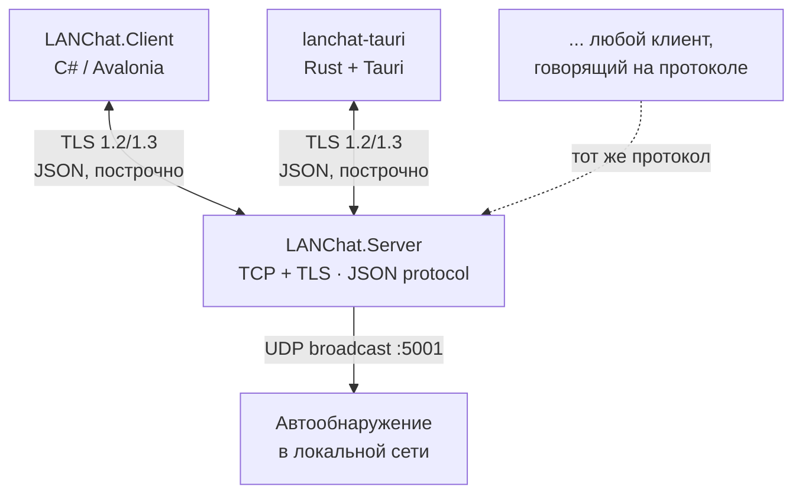

<div align="center">

# 💬 LANChat

**Защищённый мессенджер для локальной сети — без интернета, без серверов третьих лиц, без компромиссов.**

TCP + TLS 1.2/1.3 · JSON-протокол · Два независимых клиента · Self-hosted

[](https://dotnet.microsoft.com/)
[](https://tauri.app/)
[](https://avaloniaui.net/)
[]()
[]()

</div>

---

## О проекте

**LANChat** — это чат для локальной сети (LAN), который поднимается за секунды и не зависит ни от какого внешнего сервиса. Один компьютер запускает сервер, остальные находят его автоматически (UDP-discovery) и общаются напрямую внутри сети — весь трафик зашифрован TLS, ни одно сообщение не покидает вашу локалку.

Проект существует в двух клиентских реализациях с общим протоколом:

| | **LANChat.Client** | **lanchat-tauri** |
|---|---|---|
| Стек | C# / Avalonia UI | Rust + Tauri 2 + HTML/JS |
| Стиль | Классический десктопный GUI | New-style интерфейс |
| Платформы | Windows, Linux | Windows, Linux, macOS |
| Статус | Стабильный, полнофункциональный | Активно развивается |

Оба клиента говорят на одном JSON-протоколе поверх TLS и полностью совместимы друг с другом в рамках одного сервера.

---

## ✨ Возможности

<table>
<tr><td width="50%" valign="top">

**Ядро**
- 🖥️ TCP-сервер с полной изоляцией клиентов
- 🔐 TLS 1.2/1.3 с динамическими сертификатами
- 📡 Автообнаружение сервера в LAN (UDP, порт 5001)
- 🧵 JSON-протокол, построчная потоковая передача
- 👥 Список подключённых пользователей в реальном времени

</td><td width="50%" valign="top">

**Общение**
- 💬 Обмен сообщениями и системные уведомления
- 🗂️ История последних сообщений при подключении
- ✉️ Личные сообщения (ЛС)

- 📎 Передача файлов (чанками, base64)

</td></tr>
<tr><td width="50%" valign="top">

**Безопасность**
- 🛡️ Защита от подделки отправителя (сервер сам проставляет `Sender`)
- ⏱️ Read/Write таймауты — защита от «зависших» соединений
- 💓 Keep-Alive таймауты сокетов
- 🚫 Лимит длины сообщения (защита от переполнения памяти)
- 🐌 Rate limiting (анти-спам, 500 мс)
- 🧯 Изоляция ошибок в broadcast — один сбойный сокет не роняет остальных
- 🔤 Санитизация ников (защита от поломки протокола)

</td><td width="50%" valign="top">

**DevEx**
- ⚙️ Автоустановка (`install.sh` для Linux/Termux) — ставит .NET SDK, Rust и Node.js сам
- 🏗️ Нативные инсталляторы для Tauri-клиента 
- 🧩 Оба клиента полностью совместимы по протоколу

</td></tr>
</table>

---

## 🏗️ Архитектура


```mermaid
graph TD
    S["LANChat.Server<br/>TCP + TLS · JSON protocol"]
    C1["LANChat.Client<br/>C# / Avalonia"]
    C2["lanchat-tauri<br/>Rust + Tauri"]
    C3["... любой клиент,<br/>говорящий на протоколе"]

    C1 <-->|"TLS 1.2/1.3<br/>JSON, построчно"| S
    C2 <-->|"TLS 1.2/1.3<br/>JSON, построчно"| S
    C3 -.->|"тот же протокол"| S

    S -->|UDP broadcast :5001| D["Автообнаружение<br/>в локальной сети"]
```

Сервер не хранит ничего на диске — вся история и состояние живут в памяти процесса, пока он запущен.

---

## 📁 Структура репозитория

```
LANChat/
├── LANChat.Server/          # Консольный TCP/TLS-сервер
│   ├── ClientConnection.cs  # Обработка одного подключения, протокол
│   ├── ClientManager.cs     # Реестр клиентов, broadcast, история
│   └── Models/ChatMessage.cs
├── LANChat.Client/           # Классический GUI-клиент (Avalonia MVVM)
│   ├── Services/ChatClient.cs
│   ├── ViewModels/
│   └── MainWindow.axaml
├── lanchat-tauri/            # New-style клиент (Rust + Tauri)
│   ├── src/                  # Frontend (HTML/CSS/JS)
│   └── src-tauri/src/        # Backend (Rust, TCP/TLS-соединение)
├── install.sh / install.ps1  # Автоустановка окружения + сборка
├── publish.sh / publish.ps1  # Self-contained релизные сборки
└── LANChat.slnx
```

---

## 🚀 Установка и запуск

Ниже — три способа получить рабочий LANChat, от самого простого до самого «ручного». Выбирай по ситуации: первый вариант — если просто хочешь пользоваться чатом, третий — если хочешь контролировать каждый шаг или собрать под систему, которую автоустановщик не покрывает.

### Содержание
- [Вариант 1 — Скачать готовый релиз](#вариант-1--скачать-готовый-релиз-проще-всего)
- [Вариант 2 — git clone + автоустановщик](#вариант-2--git-clone--автоустановщик)
- [Вариант 3 — Полностью вручную](#вариант-3--полностью-вручную)
  - [Windows вручную](#windows-вручную)
  - [Linux вручную](#linux-вручную)
  - [macOS вручную](#macos-вручную)
  - [Termux вручную](#termux-вручную-только-сервер)


---

### Вариант 1 — Скачать готовый релиз (проще всего)

Не нужен ни git, ни .NET, ни Rust — всё уже собрано.

1. Открой вкладку **[Releases](../../releases)** репозитория.
2. Скачай нужный файл
3. **Windows:**
   - Для сервера и классического клиента: скачай `LANChat-win-x64.zip`, распакуй куда угодно, запусти `LANChat.Server.exe`, затем `LANChat.Client.exe` или 

---

### Вариант 2 — git clone + автоустановщик

Нужен git, а дальше всё остальное поставит и соберёт сам скрипт.

```bash
git clone https://github.com/Ghostoraner/LANchat.git
cd LANchat
```

**Linux / macOS / Termux:**
```bash
chmod +x install.sh
./install.sh
```

Скрипт сам:
1. Определит твою ОС/дистрибутив.
2. Поставит .NET 10 SDK, Rust (через rustup), Node.js и системные библиотеки, нужные Tauri для сборки (`webkit2gtk`, `gtk3`, `librsvg` и т.д. на Linux).
3. Соберёт сервер, классический клиент и новый клиент.
4. Покажет интерактивное меню, откуда можно сразу запустить любой из трёх компонентов.

Если у тебя нет git — на странице репозитория нажми зелёную кнопку **Code → Download ZIP**, распакуй архив и дальше действуй так же, начиная с `cd LANchat`.

---

### Вариант 3 — Полностью вручную

Этот путь — если автоустановщик не подошёл (экзотический дистрибутив, корпоративные ограничения на `sudo`, хочешь собрать под архитектуру ARM и т.п.) или просто хочется понимать каждый шаг.

Проекту нужно три независимых инструмента:
| Инструмент | Для чего | Проверить версию |
|---|---|---|
| **.NET 10 SDK** | Сервер (`LANChat.Server`) и классический клиент (`LANChat.Client`) | `dotnet --version` |
| **Rust (stable)** | Новый клиент (`lanchat-tauri`), бэкенд на Rust | `rustc --version` |
| **Node.js 18+** | Новый клиент, сборка фронтенда | `node --version` |

#### Windows вручную

1. **.NET 10 SDK** — скачай установщик с [dotnet.microsoft.com/download/dotnet/10.0](https://dotnet.microsoft.com/download/dotnet/10.0), запусти, доустанови. Проверь в новом окне PowerShell: `dotnet --version`.
2. **Rust** — скачай `rustup-init.exe` с [rustup.rs](https://rustup.rs), запусти, выбери пункт 1 (установка по умолчанию). **Важно:** Rust на Windows требует C++ Build Tools — установщик rustup сам предложит их поставить, если их нет (либо поставь вручную [Visual Studio Build Tools](https://visualstudio.microsoft.com/visual-cpp-build-tools/), компонент «Разработка классических приложений на C++»). Без них компиляция `lanchat-tauri` упадёт с ошибкой линковщика.
3. **Node.js** — LTS-версия с [nodejs.org](https://nodejs.org).
4. **Git** (опционально, если нет — используй «Download ZIP» на GitHub) — [git-scm.com](https://git-scm.com).
5. Клонируй и собери:
   ```powershell
   git clone https://github.com/Ghostoraner/LANchat.git
   cd LANchat
   dotnet build LANChat.slnx -c Release
   cd lanchat-tauri
   npm install
   npm run tauri build
   ```
6. Запуск:
   ```powershell
   # Сервер
   dotnet run --project ..\LANChat.Server -c Release
   # или напрямую собранный exe:
   ..\LANChat.Server\bin\Release\net10.0\win-x64\LANChat.Server.exe

   # Классический клиент
   dotnet run --project ..\LANChat.Client -c Release

   # Новый клиент — готовый .exe лежит здесь
   src-tauri\target\release\lanchat-tauri.exe
   ```

#### Linux вручную

Системные библиотеки для Tauri (нужны один раз):

```bash
# Debian / Ubuntu / Mint / Pop!_OS
sudo apt update
sudo apt install -y build-essential curl wget libssl-dev libgtk-3-dev \
  libwebkit2gtk-4.1-dev libayatana-appindicator3-dev librsvg2-dev \
  patchelf file fuse squashfs-tools

# Arch / Manjaro / EndeavourOS
sudo pacman -Sy --needed base-devel curl wget openssl webkit2gtk-4.1 \
  appmenu-gtk-module gtk3 librsvg libappindicator-gtk3 patchelf file \
  fuse2 squashfs-tools

# Fedora / RHEL / Nobara
sudo dnf groupinstall -y "Development Tools"
sudo dnf install -y openssl-devel gtk3-devel webkit2gtk4.1-devel \
  libappindicator-gtk3-devel librsvg2-devel patchelf file \
  fuse-libs squashfs-tools
```

**.NET 10 SDK** (официальный скрипт, работает на любом дистрибутиве без добавления репозиториев):
```bash
curl -sSL https://dotnet.microsoft.com/download/dotnet/scripts/v1/dotnet-install.sh -o dotnet-install.sh
chmod +x dotnet-install.sh
./dotnet-install.sh --channel 10.0
export DOTNET_ROOT="$HOME/.dotnet"
export PATH="$PATH:$DOTNET_ROOT:$DOTNET_ROOT/tools"
# добавь эти две export-строки в ~/.bashrc или ~/.zshrc, чтобы не повторять при каждом новом терминале
```
Альтернатива через пакетный менеджер (может давать версию с задержкой): Ubuntu/Debian требует сначала добавить репозиторий Microsoft —
```bash
wget https://packages.microsoft.com/config/ubuntu/$(lsb_release -rs)/packages-microsoft-prod.deb -O packages-microsoft-prod.deb
sudo dpkg -i packages-microsoft-prod.deb
sudo apt update
sudo apt install -y dotnet-sdk-10.0
```

**Rust:**
```bash
curl --proto '=https' --tlsv1.2 -sSf https://sh.rustup.org | sh -s -- -y
source "$HOME/.cargo/env"
```

**Node.js** (через nvm, не зависит от версии в репозитории дистрибутива):
```bash
curl -o- https://raw.githubusercontent.com/nvm-sh/nvm/v0.39.7/install.sh | bash
source "$HOME/.nvm/nvm.sh"
nvm install 20
```

**Клонирование и сборка:**
```bash
git clone https://github.com/Ghostoraner/LANchat.git
cd LANchat
dotnet build LANChat.slnx -c Release
cd lanchat-tauri
npm install
npm run tauri build
```

**Запуск:**
```bash
# Сервер
dotnet run --project ../LANChat.Server -c Release
# или напрямую собранный бинарник:
../LANChat.Server/bin/Release/net10.0/linux-x64/LANChat.Server

# Классический клиент
dotnet run --project ../LANChat.Client -c Release

# Новый клиент — готовый бинарник лежит здесь:
src-tauri/target/release/lanchat-tauri
```

#### macOS вручную

```bash
xcode-select --install                     # Command Line Tools (компилятор C/C++)

/bin/bash -c "$(curl -fsSL https://raw.githubusercontent.com/Homebrew/install/HEAD/install.sh)"  # Homebrew, если ещё не стоит

brew install node                          # Node.js
curl --proto '=https' --tlsv1.2 -sSf https://sh.rustup.org | sh -s -- -y   # Rust
source "$HOME/.cargo/env"

# .NET SDK — скачать установщик .pkg с dotnet.microsoft.com/download/dotnet/10.0
# (brew install dotnet-sdk тоже работает, но часто версия отстаёт)

git clone https://github.com/Ghostoraner/LANchat.git
cd LANchat
dotnet build LANChat.slnx -c Release
cd lanchat-tauri
npm install
npm run tauri build
```

Запуск — так же, как в Linux-разделе выше, бинарники окажутся в `bin/Release/net10.0/osx-x64/` и `src-tauri/target/release/`.

#### Termux вручную (только сервер)

New-style клиент (`lanchat-tauri`) — десктопное GUI-приложение, в Termux оно не запустится (нет оконной подсистемы). Классический Avalonia-клиент по той же причине тоже не рассчитан на Termux. Здесь реально поднять только **сервер**:

```bash
pkg update && pkg upgrade -y
pkg install -y wget

wget https://dotnet.microsoft.com/download/dotnet/scripts/v1/dotnet-install.sh
chmod +x dotnet-install.sh
./dotnet-install.sh --channel 10.0
export DOTNET_ROOT="$HOME/.dotnet"
export PATH="$PATH:$DOTNET_ROOT:$DOTNET_ROOT/tools"

git clone https://github.com/Ghostoraner/LANchat.git
cd LANchat
dotnet run --project LANChat.Server -c Release
```

Подключаться к такому серверу с телефона/планшета нужно другим устройством с полноценным клиентом (Windows/Linux/macOS) — телефон в этой схеме играет роль "сервера в кармане".

---


## 📡 Протокол

Каждое сообщение — одна строка JSON, завершённая `\n`, передаётся поверх TLS-сокета.

```json
{"type":"message","sender":"Alice","content":"Привет!","timestamp":"2026-09-24T18:00:00Z","to":null}
```

| Тип (`type`) | Направление | Назначение |
|---|---|---|
| `message` | оба | Обычное или личное сообщение (см. `to`) |
| `typing` | клиент → сервер → все | Индикатор «печатает…» |
| `file_chunk` | оба | Один чанк файла (base64), см. поля ниже |
| `history` | сервер → клиент | Снимок последних сообщений при подключении |
| `users` | сервер → все | Список онлайн-пользователей (через запятую) |
| `system` | сервер → все | Присоединение/выход, служебные уведомления |
| `error` | сервер → клиент | Ошибка (занятый ник, спам и т.д.) |

**Общие поля:** `sender`, `content`, `timestamp`
**Личные сообщения:** `to` — ник получателя (пусто/`null` = всем)
**Файлы:** `transferId`, `fileName`, `fileSize`, `chunkIndex`, `totalChunks`

Сервер — единственный источник истины: он всегда перезаписывает `Sender` перед рассылкой, поэтому подделать отправителя с клиента невозможно.

---

## 🔒 Модель безопасности

LANChat спроектирован для **доверенной локальной сети** (дом, офис, LAN-party), а не для открытого интернета:

- Весь трафик шифруется TLS 1.2/1.3 — пассивный перехват в сети невозможен.
- Сертификат самоподписанный и генерируется динамически при каждом запуске сервера; клиенты сознательно не проверяют его подлинность (`danger_accept_invalid_certs` / аналог в C#) — это защищает от пассивного прослушивания, но **не от активного MITM внутри самой LAN**. Компромисс осознанный: полноценный PKI избыточен для локального чата.
- Сервер валидирует и обрезает никнеймы, ограничивает длину сообщений, отбрасывает избыточно частые запросы и закрывает «висящие» соединения по таймауту.

---

## 🛠️ Сборка релизов

<details>
<summary><b>Self-contained бинарники (сервер + классический клиент)</b></summary>

```bash
./publish.sh              # linux-x64 и win-x64 сразу
./publish.sh win-x64      # только один RID
```

Результат — готовые к запуску файлы без установки .NET SDK у получателя, упакованные в `release/LANChat-<rid>.zip`.
</details>

<details>
<summary><b>Нативный инсталлятор New-style клиента</b></summary>

```bash
cd lanchat-tauri
npm run build
```

Результат в `src-tauri/target/release/bundle/`: `.AppImage`/`.deb` на Linux, `.msi` на Windows, `.dmg` на macOS.
Кросс-компиляция между ОС не поддерживается — собирайте на целевой платформе или через CI с матрицей ОС.
</details>

---

## 🗺️ Статус функциональности

- [x] TCP-сервер и GUI-клиенты
- [x] Подключение, валидация и защита от дублирования никнеймов
- [x] Обмен сообщениями и системные уведомления
- [x] JSON-протокол, построчная потоковая передача
- [x] Список подключённых пользователей
- [x] Защита от мёртвых соединений (keep-alive + read/write таймауты)
- [x] Лимит длины сообщений, rate limiting, изоляция ошибок broadcast
- [x] TLS-шифрование с динамическими сертификатами
- [x] UDP-автообнаружение сервера в LAN
- [x] Защита от подделки отправителя
- [x] История сообщений
- [x] Личные сообщения
- [x] Индикатор «печатает…»
- [x] Передача файлов
- [x] Кроссплатформенные self-contained релизы
- [ ] Кастомные темы оформления

---

## 📚 Документация

Полное руководство по проекту, инструкция по установке, описание архитектуры и сетевых протоколов доступны в папке [`docs/`](./docs). 

Документация представлена на двух языках:

* 🇷🇺 **[Русскоязычная версия](./docs/RU.md)** — руководства по развёртыванию, настройке сервера и клиента, описания API и схемы подключения.
* 🇬🇧 **[Англоязычная версия](./docs/EN.md)** — полная документация на английском языке.
---

## 🤝 Вклад в проект

Пул-реквесты и issue приветствуются. Перед крупными изменениями протокола — заведите issue для обсуждения, чтобы не разъехались между собой оба клиента.

## 📄 Лицензия

Распространяется под лицензией MIT — см. [LICENSE](LICENSE).

---

© 2026 Ghostoraner  
Released under the MIT License.